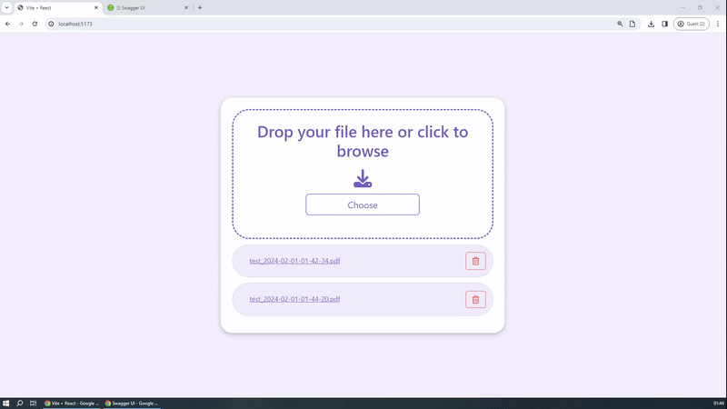
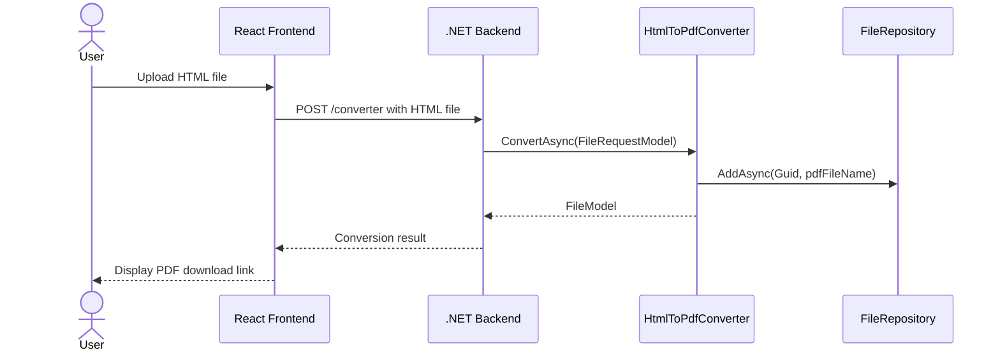
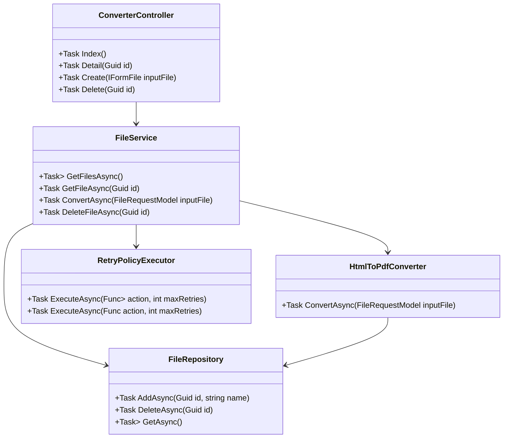
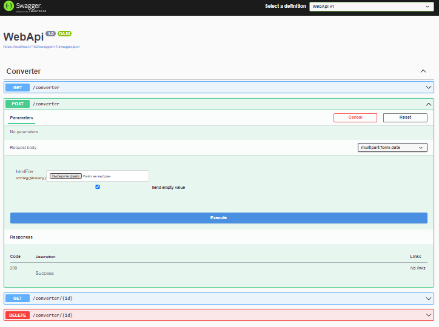
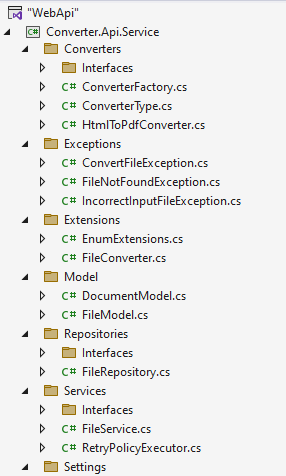
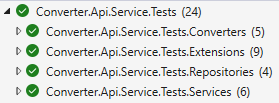
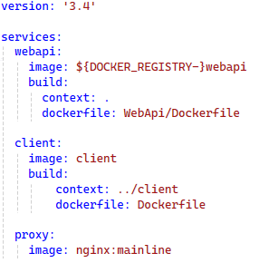

# Converter (HTML -> PDF)

## Description

This repository contains the source code for a specialized test project.

   
   
#### Sequence diagram for HTML to PDF conversion process



#### Class diagram for Converter Service


   
## Technologies Used
   - **.NET 8:** The backend of the application is built using .NET 8, taking advantage of the latest features and improvements in the .NET Core.
   - **React:** The frontend of the application is developed using React, a popular JavaScript library for building user interfaces. React enables the creation of dynamic and responsive UI components.

## Key Features of the Application

1. **Middleware: ExceptionHandlingMiddleware**
   - Middleware for handling and logging exceptions, enhancing error management.
   - Utilizes the Circuit Breaker Pattern with a Retry Policy.

     ```csharp
     app.UseMiddleware<ExceptionHandlingMiddleware>();
     ```

2. **Swagger Configuration**
   - Configured Swagger for automatic generation and display of API documentation.
   - Supports file upload through Swagger.
   
    ```csharp
     builder.Services.AddSwaggerGen(c => 
	 {
	 c.OperationFilter<AddFileUploadParams>();
	 });
     ```

3. **RESTful API Design**
   - Designed API following REST principles.
   - Supports File Upload Handling via multipart/form-data.
   
   

4. **Read Settings from JSON File**
   - Utilizes configuration files: ApplicationSettings and FileSettings.

5. **Retry Policy Executor**
   - Class for executing operations with a Retry Policy.
   - Uses the Polly library for handling temporary failures.

6. **Services: FileService and FileRepository**
   - Implements the Repository Pattern for separating responsibilities between the data storage layer and business logic.
   - Uses a Service Layer for business logic.
   
    

7. **Extension Methods**
   - FileConverter and EnumExtensions: Extensions for type and data conversion.

8. **HtmlToPdfConverter and ConverterFactory**
   - HtmlToPdfConverter converts HTML to PDF using PuppeteerSharp.
   - Utilizes the Factory Pattern for creating converter instances.
   - Applies the Adapter Pattern for converting HTML to PDF.

## Additional:

- **Async/Await**
  - Uses asynchronous programming for improved performance in I/O operations.

- **Logging**
  - Applies a logging system to track errors and operations.

- **DI (Dependency Injection)**
  - Dependency injection is used to ensure code extensibility and testability.

- **API Documentation**
  - Swagger/OpenAPI is used for API documentation and testing, providing interactive documentation and client SDK generation.

- **xUnit Test Framework**
  - Used for writing and running automated unit tests
  - Covers API endpoints, service layer, and data access logic
  - Includes integration tests for database operations

 

- **docker & docker-compose**

 